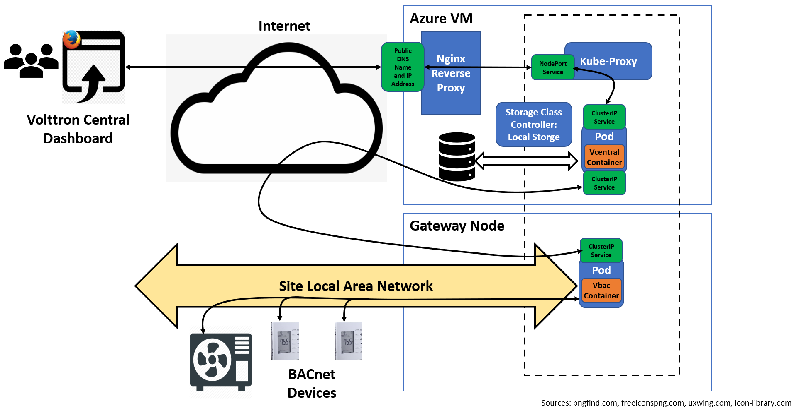

# Deploying a Kubernetes cluster for Volttron microservices

`kube-volttron` uses [Wireguard VPN](https://www.wireguard.com/) 
for point to point encrypted communication
between the central node VM and the gateway node
and [`kubeadm`](https://kubernetes.io/docs/reference/setup-tools/kubeadm/) 
to configure and administer the cluster. While there
are simpler Kubernetes distros to install, they generally are 
opinionated about networking in ways that make setting up and 
maintaining multi-interface pods difficult. These directions walk you 
through:

- Creating and configuring two VMs to run the central node and the
gateway node. Two options are described:
	1. Create both VMs using VirtualBox on a local server or laptop,
	2. Create the central node VM in a cloud VM and the gateway VM 
	   in a VirtualBox VM on a local server or laptop. 

- Installing and configuring a Wireguard VPN running through a `wg0` 
interface between the central node and gateway node VMs. 

- Installing and configuring the basic Kubernetes
and `kubeadm` packages on both nodes. 

- Creating a cluster with `kubeadm` in which the central node is 
installed as a control
node, although it is configured to run workloads too, and the gateway
node is configured as a worker node. 

- Installing and
configuring the Flannel and Multus CNI (Container Network Interface)
plugins on the central node. Flannel 
is used for the intra-cluster, pod-to-pod network, and Multus is used to
provide a second interface for pods running in the gateway nodes that 
have special networking needs, like, for example, using broadcast to discover
devices in the site's local area network. Pods can't access the site 
local network directly through Flannel.

The instructions were developed on the Ubuntu 20.04 operating system, so
your mileage may vary if you use a different one.

## Option 1: Creating and configuring the VMs for both the central and gateway nodes using VirtualBox.

VMs running Ubuntu 20.04 with 2 vCPUs and 4 GB RAM are recommended. 
The VM for the central node requires one network interface 
while the VM for the gateway node requires two interfaces to support
a two interface gateway pod. The following instructions step you through
creating the two VMs on VirtualBox.

### Import an ISO or clone an existing VM.

You will need two VMs, one for the central node and one for the
gateway node, so follow the instructions in this section twice.

To import a VM, you should have an ISO image of the VM available. Click on the 
*New* button in the top menu of the VirtualBox app and follow the 
series of dialog boxes to import the image.

To clone an existing VM, right clicking on the VM you want to clone 
in the left side 
menu bar and choosing *Clone* from the VM menu. The VM should have
the same memory and disk as for the central node. Name the central node VM
`central-node` and the gateway node VM `gateway-node`.
In the *MAC Address Policy* pulldown, scroll down to the setting *Generate new MAC addresses for all network adaptors*. It is important that each VM
has a unique MAC address because Kubernetes uses the MAC address as part
of its algorithm to name pods.

### Bring up the Network Settings tab
After the clone finishes, 
right click on the new VM in the left side menu bar of the VirtualBox app
to bring up the VM menu, then click on *Settings*. When
the *Settings* tab is up, click on *Network* in the left side menu bar. You should get a tab that looks like this:

Set your first interface to *Bridged Adaptor*. Click on the *Advanced* arrow and make sure the *Cable Connected* 
checkbox is checked. 

### Configure the second interface on the gateway node

Click on the *Adaptor 2* tab then
click the check box marked *Enable Network Adaptor*. Select the 
*Bridged Adaptor* for the network type. Click on the *Advanced* arrow and make sure the *Cable Connected* 
checkbox is checked. 

### Save the configuration

Save the configuration by clicking on the *OK* button at the bottom right.

Start the VMs  by bringing up the VM menu again and clicking
on *Start*->*Normal Start*.

## Option 2: Create a gateway node VM on a local machine with VirtualBox and a central node VM in a public cloud.

The first step is to create the gateway node on your local machine following
the instructions in the previous section, and find the public IP address of the gateway node.
You can find the address by browsing to [`whatsmyip.org`](http://www.whatsmyip.org) from a browser running on `gateway-node`.
You should write it down because you will need it during Wireguard configuration.
Then follow the directions below
to create a cloud VM for the central node.

### Introduction to using a public cloud VM for the central node.

While there are a few ways to export a service from a Kubernetes cluster,
the primary way Kubernetes supports is by using service type called a
LoadBalancer. LoadBalancer services require an additional piece of
infrastructure, a cloud provider's load balancer service. 
Load balancers are not cheap and if you
look at the instructions for deploying them, they are really complicated
with lots of places where things can go wrong. There
is a load balancer available for non-managed service deployments, called
[MetalLB](https://metallb.universe.tf/) but it doesn't work in cloud
deployments because it does not have access to the cloud providers' 
proprietary SDN APIs. 

Instead of using a LoadBalancer service, we export the Volttron Central
Web service using a NodePort service. NodePort services are restricted
to a particular port range, but can be accessed from outside
the cluster through the IP address provided in their Endpoint objects. 
We expose the NodePort service
through a public Internet address/DNS name provided by the cloud provider for
the VM
using the [Nginx reverse proxy](https://docs.nginx.com/nginx/admin-guide/web-server/reverse-proxy/). A **reverse proxy** accepts incoming HTTP requests and
simply forwards them to a different URI. This section explains how to open
ports in the VM's Internet firewall and how to install Nginx, the instructions
in [`../gateway-node/README.md`](../gateway-node/README.md) explain how
to configure the Nginx reverse proxy after the instructions
about how to deploy the `vcentral` microservice
which runs the Volttron Central website.

The figure below illustrates the overall architecture of `kube-volttron` with
the Volttron Central web service and historian running in a cloud VM and
the gateway node running in a local VM with Nginx reverse proxying the 
Volttron Web site.

### Creating a central node VM in a public cloud.

Create a VM in a public cloud running Ubuntu 20.04 
using the cloud provider's portal. 
I created a Standard B2ms 2 vcpus, 8 G memory in Azure, so the instructions
below assume you are working with the Azure portal. Name the VM `central-node`
to make the following instructions easier.

The cloud provider's firewall should
have port 22 open for SSH on the VM. If the source is *Any*, meaning any IP address, you should set the 
source to the `gateway-node` VM IP address since you will likely want to work from a shell window there.

You will need to 
open ports for Wireguard
and the Nginx reverse proxy. Bring up the Azure dashboard
display for your VM by clicking on *All resources*->*central-node*.
In the left side menu, click on *Networking*. Click on the blue 
*Add inbound port rule* button and fill out the form
with the following for the Wireguard port:

- *Source*: *IP Address*.
- *Source IP addresses/CIDR ranges*: IP address of the `gateway-node` host.  
- *Source port ranges*: Leave at default of *** (any).
- *Destination*: Leave at default of *Any*.
- *Service*: Leave at *Custom*.
- *Destination Port Ranges*: 51820, the Wireguard port
- *Protocol*: Check the *UDP* box.
- *Action*: Leave the *Allow* box checked.
- *Priority*: Leave at the default.
- *Name*: Wireguard.
- *Description*: Port for Wireguard VPN.

After you've configured a port for Wireguard, configure one for Nginx with
the following:

- *Source*: *IP Address*.
- *Source IP addresses/CIDR ranges*: IP address of the `gateway-node` host.
- *Source port ranges*: Leave at default of *** (any).
- *Destination*: leave at default of *Any*.
- *Service*: *HTTP*.
- *Destination Port Ranges*: It will be set to 80 and greyed out.
- *Protocol*: Leave the *TCP* box checked.
- *Action*: Leave the *Allow* box checked.
- *Priority*: leave at the default.
- *Name*: Nginx.
- *Description*: Port for Nginx reverse proxy.

### Install Nginx in the cloud VM

The next step is to install Nginx on the `central-node` node cloud VM. 
Use the instructions [here](https://docs.nginx.com/nginx/admin-guide/installing-nginx/installing-nginx-open-source/). They are very straightforward. You can
install Nginx Plus if you want, but these instructions were developed with
open source Nginx.

Note that you can't configure Nginx yet because you need to know the IP
address and port of the NodePort service `vcentral` will be using, which
will come when we install `vcentral`.

## Configuring the VMs for the Kubernetes cluster

Prior to installing the cluster, the VMs require some additional configuration.

### Find the public IP addresses of `gateway-node` and `central-node`

You will need these for configuring the Wireguard VPN. If both nodes are running in VirtualBox VMs
on the same site local network, then the IP address should be the address on 
the interface with the smallest number as the last character in it's name, for
example `enp0s3`. You can use `ip address` to find it. 

If the `central-node is running on a cloud VM, the public IP address should be on
the dashboard for the VM. For example, in Azure, it is located in a field
with title *Public IP address:*. The public address of the `gateway-node`
depends on whether you are running in a corporate LAN or accessing the
Internet through an ISP network. If you are running in a corporate LAN,
ask your IP support people what you should use for your public IP 
address. If you are connecting through an ISP, as described above,
you can find your address at `whatsmyip.org`

Write down both addresses somewhere.

### Disable any local firewalls

Unless one or the other of your VMs is directly connected to the Internet
without a cloud provider, ISP, or corporate firewall wall, you should 
disable any firewall running directly on the VM since
it may interfere with your ability to get to the Volttron Central website. 

For example, if you think you may have `firewalld` running, 
you can find out with:

	systemctl status firewalld.service

If you get output like this:

	firewalld.service - firewalld - dynamic firewall daemon
         Loaded: loaded (/lib/systemd/system/firewalld.service; enabled; vendor preset: enabled)
         Active: active (running) since Tue 2022-07-12 15:05:27 UTC; 6h ago
		 
then use `systemctl` to  disable it: 
	
	sudo systemctl stop firewalld.service
	sudo systemctl disable firewalld.service
	
If you are on a 
corporate LAN, check with your security people if there is a corporate 
firewall and, if so, you should request that the Wireguard port and the
HTTP port be opened. If either or both of your VMs are directly connected
to the Internet, then by all means, start a firewall and configure 
the two ports to be opened directly on the VM! 

### Preparing the operating system on both VMs

Prior to installing Wireguard, be sure to set the hostname on both
nodes:

	hostnamectl set-hostname <new-hostname>
	
and confirm the change with:

	hostnamectl

If you used the names `central-node` and `gateway-node` to create
the VMs, the host name should be set, but if you cloned the VMs, you
may need to change it.
You should not have to reboot the node to have the hostname change take
effect.

You should also install your favorite editor if it isn't there, and packages containing network debugging tools including `net-tools` and `inetutils-traceroute` (for `ifconfig` and `traceroute`) just in case you need them.

Kubenetes uses the hardware MAC addresses and machine id to identify
pods. Use the following to ensure that the two nodes have unique 
MAC addresses and machine ids:

- Get the MAC address of the network interfaces using the command `ip link` or `ifconfig -a`,
- Check the product\_uuid by using the command `sudo cat /sys/class/dmi/id/product_uuid`.

Kubernetes also needs specific ports to be free, see [here](https://kubernetes.io/docs/reference/ports-and-protocols/) for list. You can check which ports are
being used with:

	sudo ss -lntp
	
Next, turn off swap on the VMs:

	sudo swapoff -a
	sudo sed -i '/ swap / s/^\(.*\)$/#\1/g' /etc/fstab
	
Next, we need to enable routing on both nodes by `sudo` editing
`/etc/sysctl.conf` and deleting the `#` character at the beginning of the lines with `net.ipv4.ip_forward=1` and 
`net.ipv6.conf.all.forwarding=1` to enable routing on the host after reboot, if they aren't already.

Then use the command:

	sudo sysctl <routing variable>=1

where `<routing variable>` is  `net.ipv4.ip_forward` and `net.ipv6.conf.all.forwarding` to enable routing in the running host.

You can test whether your configuration has worked by running:

	sudo sysctl -a | grep <routing variable>

Finally, enable the bridge net filter driver `br_netfilter`:

	sudo modprobe br_netfilter
	
Edit the file `/etc/modules` as superuser and add a line with `br_netfilter` 
on it so the module will be reloaded when the VM reboots.

## Installing and configuring the Wireguard VPN

Wireguard creates a virtual interface on a node 
across which a UDP VPN connects to other
peers. The interface has a public and private key associated with it that
are used for decrypting and encrypting the packets, respectively. 
The link between one peer and another 
is point to point. 
We will be using the 10.8.0.0/24 subnet over `wg0` with the
`central-node` having address 10.8.0.1 and `gateway-node` having address
10.8.0.2.

Most of the pages with instructions for installing and configuring 
Wireguard on the 
Ubuntu 20.04 assume you want to deploy it as a VPN server and route through it 
to other
services, in order to hide your local machine's or mobile phone's IP address.
The result is that the web pages include instructions for configuring iptables
to route packets out of the VM, which are completely unnecessary for the
`kube-volttron` use case. 
`kube-volttron` doesn't need this, since we will be running the Kubernetes control
and data plane traffic between nodes in the cluster and routes to other
services on other nodes will be handled by Kubernetes. 
The best guide I've found is at [this link](https://www.digitalocean.com/community/tutorials/how-to-set-up-wireguard-on-ubuntu-20-04). The author notes 
where you can skip configuration instructions for deploying Wireguard as 
a VPN server, and includes instructions for configuring with IPv6 which
are nice if you have IPv6 available but only increase the complexity. Below,
I've summarized the instructions for installing and configurating Wireguard
specifically for the `kube-volttron` use case using IPv4.

### Installing Wireguard and related packages

Update/upgrade on both the gateway node and central node with:

	sudo apt update
	
After the update is complete, install Wireguard:

	sudo apt install wireguard

`apt` will suggest you install one of `openresolv` or `resolvconf`, the
following instructions are based on installing `resolvconf`:

	sudo apt install resolvconf
	
### Wireguard commands

Wireguard comes with two utilities:

- `wg`: the full command line utility for setting up a Wireguard interface.

- `wg-quick`: a simpler command line utility that summarizes frequently 
used collections of command arguments under a single command. 

The configuration file and public and private key files for the 
Wireguard are kept in the directory
`/etc/wireguard`. 

### Generating public and private keys on both nodes

Starting on `central-node`, generate a private and public key using the 
Wireguard `wg` command line utility:

	wg genkey | sudo tee /etc/wireguard/private.key
	sudo chmod go= /etc/wireguard/private.key

The first command generates a base64 encoded key and echoes it to 
`/etc/wireguard/private.key` and to the terminal, the second changes 
the permissions so
nobody except root can look at it.

Next, generate a public key from the private key as follows:

	sudo cat /etc/wireguard/private.key | wg pubkey | sudo tee /etc/wireguard/public.key
	
This command first writes the private key from the file to `stdout`, then generates the public key with `wg pubkey`, then writes the public key to 
`/etc/wireguard/public.key` and to the terminal. 

Now, switch to `gateway-node` and run the same commands. 

### Creating the `wg0` interface configuration file on the `gateway-node`

The next step is to create a configuration file for `gateway-node`.
Using your favorite editor, open a new file `/etc/wireguard/wg0.conf` 
(running as `sudo`). Edit the file to insert the following configuration:

	[Interface]
	PrivateKey = <insert gateway node private key here>
	Address = 10.8.0.2/24
	ListenPort = 51820

	[Peer]
	PublicKey = <insert central node public key here>
	AllowedIPs = 10.8.0.0/24
	Endpoint = <insert public IP address of your central node here>:51820
	PersistentKeepalive = 21

Add the private key of the `gateway-node`, public key of `central-node`,
and public IP address of `central-node` where indicated. The public
IP address could also just be a DHCP address on the local subnet if
you are using a local VM for the central node. Save the file and exit the editor.

### Creating the `wg0` interface configuration file on the `central node`

Edit the file `/etc/wireguard/wg0.conf` as superuser:

	[Interface]
	PrivateKey = <insert private key of central-node here>
	Address = 10.8.0.1/24
	ListenPort = 51820
	
	[Peer]
	PublicKey = <insert gateway-node public key here>
	AllowedIPs = 10.8.0.0/24
	Endpoint = <insert public IP address of gateway-node here>:51820
	PersistentKeepalive = 21

Add the private key of the `central-node`, public key of `gateway-node`,
and public IP address of `gateway-node` where indicated. The public
IP address could also just be a DHCP address on the local subnet if
you are using a local VM for both nodes. Save the file and exit the editor.

### Installing a system service for the `wg0` interface 

Starting on `gateway-node`, we'll use `systemctl` to create a system
service that creates and configures
the Wireguard `wg0` interface when the node boots. To enable the system 
service, use:

	sudo systemctl enable wg-quick@wg0.service
	
start the service with:

	sudo systemctl start wg-quick@wg0.service
	
and check on it with:

	sudo systemctl status wg-quick@wg0.service

to see the service status. This should show something like:

	 wg-quick@wg0.service - WireGuard via wg-quick(8) for wg0
     Loaded: loaded (/lib/systemd/system/wg-quick@.service; enabled; vendor preset: enabled)
     Active: active (exited) since Fri 2022-05-20 15:17:27 PDT; 12s ago
       Docs: man:wg-quick(8)
             man:wg(8)
             https://www.wireguard.com/
             https://www.wireguard.com/quickstart/
             https://git.zx2c4.com/wireguard-tools/about/src/man/wg-quick.8
             https://git.zx2c4.com/wireguard-tools/about/src/man/wg.8
    Process: 2904 ExecStart=/usr/bin/wg-quick up wg0 (code=exited, status=0/SUCCESS)
	Main PID: 2904 (code=exited, status=0/SUCCESS)

	May 20 15:17:27 central-node systemd[1]: Starting WireGuard via wg-quick(8) for wg0...
	May 20 15:17:27 central-node wg-quick[2904]: [#] ip link add wg0 type wireguard
	May 20 15:17:27 central-node wg-quick[2904]: [#] wg setconf wg0 /dev/fd/63
	May 20 15:17:27 central-node wg-quick[2904]: [#] ip -4 address add 10.8.0.1/24 dev wg0
	May 20 15:17:27 central-node wg-quick[2904]: [#] ip link set mtu 1420 up dev wg0
	May 20 15:17:27 central-node systemd[1]: Finished WireGuard via wg-quick(8) for wg0.
	
Notice that the status prints out the `ip` commands that were used to
create the interface. You can also see the `wg0` interface using:

	ip address

After you've started the system service on `gateway-node`,
follow the same instructions as above for installing a system service to bring
up the `wg0` interface on `central-node`.

### Checking `wg0` status and bidirectional connectivity

You can check the status of the `wg0`interface by running:

	sudo wg

on both nodes. It should print out something like:

	public key: dScu7fYSEKrZFdNYqycAyeqJdz9utYXGcgYP9YPc2Sg=
	private key: (hidden)
	listening port: 51820

	peer: V7EWFuM1qARFs1ldwCx2P6HOMcTMU5yY51QSw4t5gCI=
  	  endpoint: 20.94.218.214:51820
	  allowed ips: 10.8.0.0/24
	  latest handshake: 1 minute, 42 seconds ago
	  transfer: 1.29 KiB received, 4.72 KiB sent
	  persistent keepalive: every 21 seconds

where the important point is that the keep-alive transfer is not showing zero.

Check for bidirectional connectivity by pinging first on the central node:

	ping 10.8.0.2
	
then on the gateway node:

	ping 10.8.0.1

### Configuring additional gateway nodes.

To configure additional gateway nodes, install Wireguard on the node and 
generate
a public and private key as described above. Then select an IP address
for the gateway node `wg0` interface in the `10.8.0.0/24` range, incrementing
the last number by one each time you configure a new node. You can
have a maximum of 254 gateway nodes on the VPN. Create a 
configuration file for `wg0` in `/etc/wireguard/wg0.conf` on
the new gateway node, being sure
to add the appropriate keys and IP address as described above. You can copy
the file above and change the configuration key values as appropriate. Use
the `systemctl` commands above for starting the Wireguard service on the new 
gateway node.

You should not need to configure the central node as it should recognize IP
addresses in the `10.8.0.0/24` range. Test the configuration with `ping`.

## Creating the Kubenetes cluster

These instructions are a condensation of the `kubeadm` installation
instructions [here](https://kubernetes.io/docs/setup/production-environment/tools/kubeadm/install-kubeadm/) and cluster configuration instructions
[here](https://kubernetes.io/docs/setup/production-environment/tools/kubeadm/create-cluster-kubeadm/)

### Installing the Kubernetes packages

Clone this github repo (`kempf42/kube-volttron`) and perform the following steps on both nodes.

#### Installing the `containerd` container runtime package and configuring a system service

Instructions for installing the latest version of `containerd` and 
configuring can be found 
[here](https://github.com/containerd/containerd/blob/main/docs/getting-started.md),
but they are slightly different for Ubuntu 20.04, so we use the easier
path of installing the `apt` package:

	sudo apt install containerd
	
This will install the package and configure and a `systemd` service
with properly formatted unit file, start the service, and
install a container runtime socket in the right place, which has the
added advantage of installing the default `systemd` 
[cgroup driver](https://kubernetes.io/docs/tasks/administer-cluster/kubeadm/configure-cgroup-driver/).

#### Check whether the nodes have the Kubernetes `apt` repo.

The next step is to install `kubeadm`, `kubelet`, and `kubectl` on both
nodes. First check whether you already have access to the repository with:

	sudo apt policy | grep kubernetes
	
If you see something like:

	500 https://apt.kubernetes.io kubernetes-xenial/main amd64 Packages
     release o=kubernetes-xenial,a=kubernetes-xenial,n=kubernetes-xenial,l=kubernetes-xenial,c=main,b=amd64
     origin apt.kubernetes.io

Skip forward to the next section. If not, then do the following.

Update the `apt` package index and install packages needed to use the Kubernetes apt repository:

	sudo apt-get update
	sudo apt-get install -y apt-transport-https ca-certificates curl

Download the Google Cloud public signing key:

	sudo curl -fsSLo /usr/share/keyrings/kubernetes-archive-keyring.gpg https://packages.cloud.google.com/apt/doc/apt-key.gpg

Add the Kubernetes apt repository:

	echo "deb [signed-by=/usr/share/keyrings/kubernetes-archive-keyring.gpg] https://apt.kubernetes.io/ kubernetes-xenial main" | sudo tee /etc/apt/sources.list.d/kubernetes.list
	
#### Installing the Kubernetes system utility packages and `kubeadm`

To install the Kubernetes utilities and `kubeadm` type the following commands:

	sudo apt-get update
	sudo apt-get install -y kubelet kubeadm kubectl
	sudo apt-mark hold kubelet kubeadm kubectl

This installs `kubelet` as a `systemd` service and marks the Kubernetes 
utilites so that they are not automatically updated. The `kubelet` on
the `gateway-node` will need some configuration but we need to configure it
after the gateway node has joined the cluster.

Note that if the installtion suggests you install any firewall packages, 
don't install them since this will considerably complicate the cluster
connectivity. If you followed the directions above on firewalls, you should
already have a firewall installed, running, and configured if your host
is connected directly to the Internet.

## Creating a cluster with `kubedm`

### Installing `central-node` as a control node

First step is to run `kubeadm` with arguments specific to configuring 
`central-node` as a control node
The following arguments need to be set:

- Since we are using Flannel, we need to reserve the pod CIDR using 
`--pod-network-cidr=10.244.0.0/16`. This reserves
IP address space for the inter-pod, intra-cluster network.

- We need to advertise the API server 
on the `wg0` interface so all
traffic between the central node 
and the gateway nodes is encrypted.
If you followed the Wireguard numbering scheme above, 
then use `--apiserver-advertise-address=10.8.0.1`, otherwise,
substitute the address you assigned to the `wg0` interface on the central
node.

-- The `containerd` socket should be specified using the argument 
`--cri-socket=unix:///var/run/containerd/containerd.sock` in case
there are any other container runtime sockets lying about.

Run `kubeadm init` on the central node:

	sudo kubeadm init --pod-network-cidr=10.244.0.0/16 --apiserver-advertise-address=10.8.0.1 --cri-socket=unix:///var/run/containerd/containerd.sock
	
When `kubeadm` is finished, it will print out:

	Your Kubernetes control-plane has initialized successfully!
	
	You should now deploy a Pod network to the cluster.
	Run "kubectl apply -f [podnetwork].yaml" with one of the options listed at:
	/docs/concepts/cluster-administration/addons/

	You can now join any number of machines by running the following on each node
	as root:

	kubeadm join <control-plane-host>:<control-plane-port> --token <token> --discovery-token-ca-cert-hash sha256:<hash>

To start using your cluster as a nonroot user, 
you need to run the following as a regular user:

	mkdir -p $HOME/.kube
	sudo cp -i /etc/kubernetes/admin.conf $HOME/.kube/config
	sudo chown $(id -u):$(id -g) $HOME/.kube/config

Copy down the final `kubeadm join` command since we will use this shortly to
join the gateway node to the central node control plane.

#### Removing the taint on the control node prohibiting application workload deployment.

As installed out of the box, `kubeadm` places taints on the control node
disallowing deployment of application workloads. Since we want to deploy the
Volttron Central pod `vcentral` there, we need to remove the taints:

	kubectl taint node <central node hostname> node-role.kubernetes.io/master-
	
which should print out:

	node/<central node hostname> untainted

and also run the command:

	kubectl taint node <central node hostname> node-role.kubernetes.io/control-plane-
	
You can check if the node is untainted with:

	kubectl get nodes -o custom-columns=NAME:.metadata.name,TAINTS:.spec.taints --no-headers
	
which should show `<none>` on the central node.

#### Installing the Flannel CNI plugin on the central node

On `central-node`, use the file `kube-flannel-wireguard.yaml` 
to install Flannel. By default, 
the Flannel controller assumes it should use the IP address from the 
first nonloopback interface as the public address of the node. 
The `kube-flannel-wireguard.yml` manifest 
contains some code to tell the Flannel controller
that the machine's interface is `wg0` instead of `enp0s3`. 
Install Flannel before bringing up the `gateway-node`.

To install Flannel:

	kubectl apply -f kube-flannel-wireguard.yaml
	
Note that Flannel now deploys into its own namespace, `kube-flannel`, 
rather than into the `kube-system` namespace.

You can check if Flannel is running with:

	kubectl get -n kube-flannel all

Flannel uses an annotation on the Kubernetes
Node object to determine the public IP address of the node.
Check for the annotation with:

	kubectl describe node <node-name> | grep flannel.alpha.coreos.com/public-ip

where `<node-name>` is `central-node` now and `gateway-node` later
when you bring it up. It should  be `10.8.0.1` on `central-node`. 
When `gateway-node` is up, check that it is `10.8.0.2`.

Also, you need to turn the checksum off on the `flannel.1` interface
to improve performance. The one shot command is :

	sudo ethtool -K flannel.1 tx off
	
For reboot, set up a `systemd` service as follows. 

- Copy the file `100-flannel-trigger-rules` into `/etc/udev/rules.d`

- Copy the file `flannel-created@.service` into `/etc/systemd/system`.

- Reload via:

	`sudo systemctl daemon-reload
	sudo systemctl restart systemd-udevd.service`

#### Installing the Multus CNI plugin on the central node

The Multus CNI driver enables pods to have multiple interfaces, and we
need it to get a second interface on the BACnet pod `vbac` so it can
access BACnet devices on the site local area network. To install Multus, 
first clone the Multus git repo on `central-node`:

	git clone https://github.com/k8snetworkplumbingwg/multus-cni
	
Then change into the `multus-cni` directory and apply the yaml manifest:

	cat ./deployments/multus-daemonset-thick-plugin.yml | kubectl apply -f -
	
To check whether Multus is running:

	kubectl get -n kube-system pods | grep multus

###  Installing `gateway-node` as a worker node

Perform the following steps on `gateway-node`.

#### Configuring `gateway-node` to join the cluster as a worker node

To join `gateway-node` to the cluster as a worker node, use the
`kubeadm join` command that `kubadm init` printed out just before
it finished, adding on the argument for the CRI socket, for example:

	sudo kubeadm join 10.8.0.1:6443 --token <your token> \
	--discovery-token-ca-cert-hash <your discovery hash> --cri-socket=unix:///var/run/containerd/containerd.sock
	
The token is only good for a day, if you need to install more gateway nodes,
use this command on `central-node` to create a new one:

	kubeadm token create

If you don't have the value of `--discovery-token-ca-cert-hash` you can find by running this command on `central-node`:

	openssl x509 -pubkey -in /etc/kubernetes/pki/ca.crt | openssl rsa -pubin -outform der 2>/dev/null | \
	openssl dgst -sha256 -hex | sed 's/^.* //'

	
Finally, to use `kubectl` on the gateway node to deploy pods, you need
to copy the config file from your `~/.kube` directory 
over from the control node to the gateway node. 
Also copy the file into `/etc/kubernetes/admin.conf` as root on the 
gateway node so other users have access to it.

#### Reinitializing the `kubelet` on `gateway-node` with the `wg0` IP address

The `kubeadm join` command uses the first interface on the node to 
to determine the Node object's public IP address. This address is then
used to start the `kubelet` which acts as the local node manager.
Since `wg0` is not the 
first interface, the node's `kubelet` may not be
accessable from `central-node` if the the central and gateway nodes are
not in the same routing domain. In addition, if the Kubernetes control
plane doesn't run over the Wireguard VPN, it will not be encrypted.
We need to reinitialize the `kubelet` with the correct 
address. If this step is not taken, `central-node` will get a routing
error when it tries to contact the `kubelet` on `gateway-node`, for example,
when trying to `exec` into a pod using `kubectl`.

First step is to edit the `kubelet` file in this directory and 
replace `10.8.0.2` with 
the IP address of your `wg0` interface if you changed it 
then copy the file into `/etc/default`. The arguments are 
added to the startup command for the `kubelet` 
by the `systemd` unit file and will cause the `kubelet` to report that 
the IP address of the node is the same as the `wg0` interface rather than 
that of a default interface like `enp0s3`.

Second step is to edit the file `/var/lib/kubelet/config.yaml` and 
add a line after the `apiVersion:` line with the `address:` key and `wg0`
IP address as the value, for example:

	address: 10.8.0.2

This will cause the `kubelet` to listen on that address rather than the
default (`0.0.0.0`) [^1]

Finally, restart the `kubelet` using `systemctl`:

	sudo systemctl stop kubelet
	sudo systemctl disable kubelet
	sudo systemctl enable kubelet
	sudo systemctl start kubelet

You can test it by checking what interface the `kubelet` is running on:

	sudo ss -ltp | grep kubelet
	LISTEN    0         4096             127.0.0.1:10248             0.0.0.0:*       users:(("kubelet",pid=4748,fd=35))                                             
	LISTEN    0         4096              10.8.0.2:10250             0.0.0.0:*       users:(("kubelet",pid=4748,fd=27))                  

[^1]: Strictly speaking, this isn't necessary since the `kubelet` will listen
to all addresses but it helps confine any communication to the VPN.

#### Deploying the CNI DHCP relay on `gateway-node`

Multus requires IP address management (ipam) to be specified for the second
interface in pods. The yaml manifest for deploying the 
BACnet gateway pod on the gateway node
uses DHCP for ipam to obtain an address on the site local network. 
The CNI DHCP relay must be running
on the gateway node itself to connect with the local
subnet DHCP server. This section describes how to deploy the CNI DHCP
relay as a `systemctl` service so the relay is restarted when the node
reboots. Although we only need an address on the gateway site network,
we install the relay on both the central node and gateway node, in case
a central node pod also needs an address on the local network.

The first step is to copy the shell script 
`cleanstart-cni-dhcpd.sh`, which cleans up any old sockets and starts the daemon, from `cluster-config` to `/usr/local/bin`:

	sudo cp cleanstart-cni-dhcpd.sh /usr/local/bin

Then create `/run/cni` and 
change the permissions on it so the daemon can access it:

	sudo mkdir /run/cni
	sudo chmod a+rx /run/cni

The next step is to copy the `cni-dhcpd-relay.service` file in this directory
into `/etc/systemd/system`, enable and start the service:

	sudo cp cni-dhcpd-relay.service /etc/systemd/system
	sudo systemctl daemon-reload
	sudo systemctl enable cni-dhcpd-relay.service
	
After the last command, you should see the following output:

	Created symlink /etc/systemd/system/multi-user.target.wants/cni-dhcpd-relay.service → /lib/systemd/system/cni-dhcpd-relay.service.
	
Then start the service:

	sudo systemctl start cni-dhcpd-relay.service
	
You can check on the status of the service with:

	sudo systemctl status cni-dhcpd-relay.service
	
which should print out something like this:

	● cni-dhcpd-relay.service - CNI DHCP Relay Daemon
		Loaded: loaded (/lib/systemd/system/cni-dhcpd-relay.service; enabled; vendor preset: enabled)
		Active: active (running) since Wed 2022-05-11 19:10:46 PDT; 7s ago
		Main PID: 83307 (dhcp)
			Tasks: 5 (limit: 9459)
		Memory: 956.0K
		CGroup: /system.slice/cni-dhcpd-relay.service
			    └─83307 /opt/cni/bin/dhcp daemon

	May 11 19:10:46 gateway-node systemd[1]: Started CNI DHCP Relay Daemon.
	May 11 19:10:46 gateway-node cleanstart-cni-dhcpd.sh[83308]: ++ ls -A /run/cni
	May 11 19:10:46 gateway-node cleanstart-cni-dhcpd.sh[83307]: + '[' -z dhcp.sock ']'
	May 11 19:10:46 gateway-node cleanstart-cni-dhcpd.sh[83307]: + rm -rf /run/cni/dhcp.sock
	May 11 19:10:46 gateway-node cleanstart-cni-dhcpd.sh[83307]: + exec /opt/cni/bin/dhcp daemon
	
You can double check whether the damon started by typing:

	ps -aux | grep dhcp
	
which should print out something like this:

	root       83307  0.0  0.0 110288  6540 ?        Ssl  19:10   0:00 /opt/cni/bin/dhcp daemon
	
### Checking whether the cluster came up OK

Check if everything is running OK by running `kubectl` on `gateway-node`:

	kubectl get -n kube-system pods --output wide
	
you should get output looking like this:

	NAME                                   READY   STATUS    RESTARTS       AGE   IP           NODE            NOMINATED NODE   READINESS GATES
	coredns-6d4b75cb6d-n54qd               1/1     Running   1 (12m ago)    24h   10.244.0.5   central-node    <none>           <none>
	coredns-6d4b75cb6d-zdz4l               1/1     Running   1 (12m ago)    24h   10.244.0.6   central-node    <none>           <none>
	etcd-central-node                      1/1     Running   25 (12m ago)   24h   10.0.0.4     central-node    <none>           <none>
	kube-apiserver-central-node            1/1     Running   1 (12m ago)    24h   10.0.0.4     central-node    <none>           <none>
	kube-controller-manager-central-node   1/1     Running   1 (12m ago)    24h   10.0.0.4     central-node    <none>           <none>
	kube-multus-ds-6fdj6                   1/1     Running   0              24h   10.8.0.2     gateway-node2   <none>           <none>
	kube-multus-ds-9kpls                   1/1     Running   1 (12m ago)    24h   10.0.0.4     central-node    <none>           <none>
	kube-proxy-6pmkf                       1/1     Running   0              24h   10.8.0.2     gateway-node2   <none>           <none>
	kube-proxy-gpcgk                       1/1     Running   1 (12m ago)    24h   10.0.0.4     central-node    <none>           <none>
	kube-scheduler-central-node            1/1     Running   1 (12m ago)    24h   10.0.0.4     central-node    <none>           <none>

And for the Flannel network:

	kubectl get -n kube-flannel pods --output wide

and you should get output like this:

	NAME                    READY   STATUS    RESTARTS      AGE   IP         NODE            NOMINATED NODE   READINESS GATES
	kube-flannel-ds-7jd8x   1/1     Running   1 (14m ago)   24h   10.0.0.4   central-node    <none>           <none>
	kube-flannel-ds-mqbt7   1/1     Running   1 (24h ago)   24h   10.8.0.2   gateway-node2   <none>           <none>
	
Your cluster should now be ready to deploy the microservice Volttron services!

## Troubleshooting

If something goes wrong with the above procedure, you should check the links
which have more detailed instructions including links to troubleshooting
pages. One for kubeadm is [here](https://kubernetes.io/docs/setup/production-environment/tools/kubeadm/troubleshooting-kubeadm/). You may need to fall
back on Linux networking and sysadmin documentation. You can watch the progress
on pod deployment with:

	kubectl get --watch -n <namespace> pods

and events with:

	kubectl get --watch events
	
Specific per pod events can be viewed with:

	kubectl describe -n <namespace> <pod name>

Pod logs can be viewed with:

	kubectl logs --watch -n <namespace> <pod name>
	
Without the `--watch` argument, it prints out the latest and you 
can leave off the namespace argument if the item of interest is in
the default namespace. 

You can also use `systemctl status` for system services and 
`journalctl -u <service name>` to check their logs.

	

	

	

