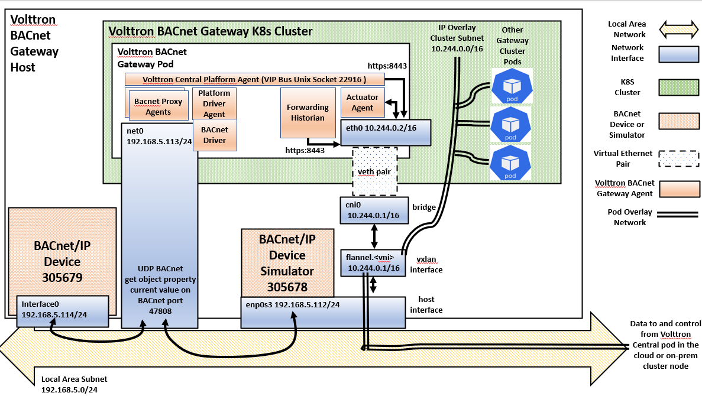
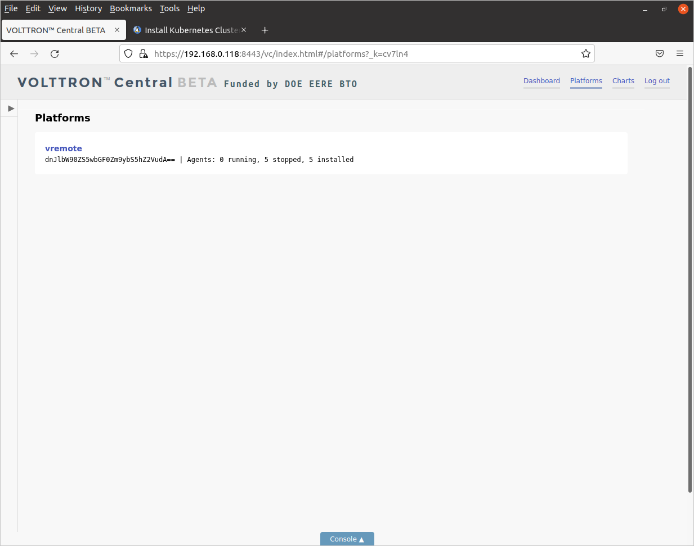
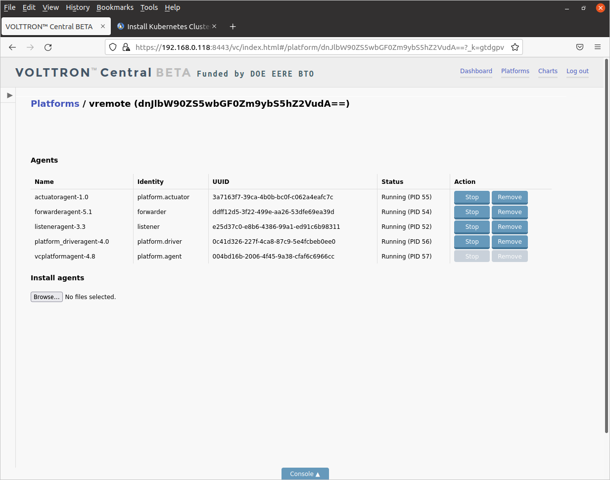
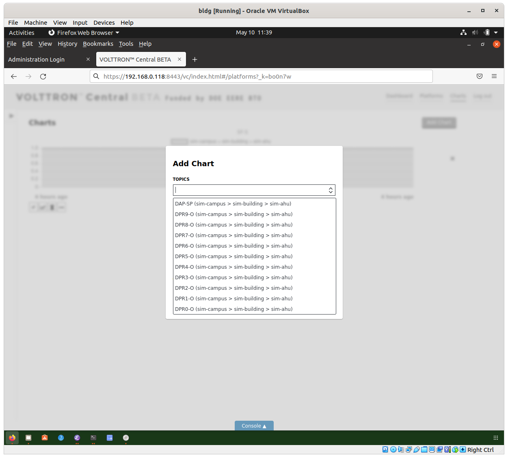

# Deploying the kube-volttron gateway node

The gateway node sits at a remote site, like in a building or at a solar farm
or a EV charger,
connected to the site's local area network with routing to the Internet.
A gateway pod with a Volttron deployment acts as an intermediary between the
IoT devices running on site and the Volttron Central pod running on the
control node in the
cloud (nominally Azure but you can change it) or in an on-prem data center. 
The gateway pod monitors IoT devices 
on the site, reports the data back to the Volttron Central node running in the
cloud, and conveys commands from Volttron Central to the devices.

You have a choice of two different preconfigured containerized Volttron microservices
for two IoT device simulators to try out:

- vremote - a Volttron microservice using the fake driver that comes with the 
Volttron distro. This microservice requires no additional simulated or
actual device and no additional network configuration.

- vbac - a Volttron microservice that handles devices using the 
[BACnet protocol](http://www.bacnet.org/). This device requires at most one device
that responds to BACnet. A [simulated AHU device](https://github.com/bbartling/building-automation-web-weather) incorporated by copy as sim_AHU.py here, based on the [BAC0](https://bac0.readthedocs.io/en/latest/) package by Christian Tremblay, is provided courtesy of Ben Barting, see below for more on how to deploy it. The vbac microservice requires additional network configuration an
overview of which is given is discussed in the next section.

## BACnet gateway node network architecture

If you decide to deploy vbac, you will need some additional networking support to
allow the Volttron BACnet proxy agent access to BACnet devices on the local area
network. By default, kube-volttron uses the [Flannel CNI driver](https://github.com/flannel-io/flannel#flannel)
for intra cluster networking between pods
as part of the k3s cluster deployment. Flannel constructs an 
isolated overlay network inside the cluster
with CIDR 10.244.0.0/16 using the [VXLAN overlay protocol](https://datatracker.ietf.org/doc/html/rfc7348), and there
is no routing between pods inside the cluster and devices outside by default, though pods on the gateway node 
can communicate with pods on other nodes in the cluster, including the Volttron Central pod on the central node, through 
the overlay. In the figure below, the BACnet Kubernetes cluster network architecture allows the vbac pod to communicate with devices on the host IP subnet by 
creating another interface in the pod connected directly to the host network.

The gateway pod is configured with an additional network interface using some advanced features of the CNI. The [Multus
multi-interface CNI driver](https://github.com/k8snetworkplumbingwg/multus-cni/blob/master/docs/configuration.md) 
connects up both the intra-cluster Flannel network and a second interface imported from
the second interface on the gateway host into the gateway pod. As part of 
setting up your cluster, you created and configured a VirtualBox VM with two interfaces on the site local
network and deployed Multus on the central node. [^1]
Both interfaces are
connected to the local area network, one is connected to the Internet through a router and one is 
absorbed into the gateway
pod when it is created.  A Kubernetes yaml manifest is provided to create a `NetworkAttachementDefinition` 
CNI object called `bacnet` 
of type `host-device` for the second interface. This obtains its DHCP address from the host IP subnet, 
allowing the Volttron BACnet Proxy Agent running in the gateway pod to conduct UDP traffic over BACnet port 47808 
with devices (both simulated
and real) running on the host IP subnet. The Volttron BACnet Proxy Agent communicates with the Volttron Platform
Driver Agent via the VIP bus running on the Unix socket 22916. Similarly, the other Volttron agents communicate
amongst themselves using the VIP bus. The Actuator Agent, Forwarding Historian, and Volttron Central Platform Agent
communicate with the Volttron Central pod using HTTPs over the intra cluster network on port 8443. 
Note that at this time the Volttron BACnet Proxy Agent does not
conduct BACnet broadcast (WhoIs/IAm) but this architecture should enable broadcast from and to the gateway
pod in the future. Without the second interface, the gateway pod cannot communicate with BACnet devices
on the host IP subnet. [^2]

[^1] Or if you aren't using VirtualBox then otherwise created an Ubuntu 20.04 node  with a second interface.

[^2] Some CNI drivers ("flat" drivers) allow direct access to the host network from pods, whether they can support
broadcast is a topic for further study. 

## Collecting information on the network interfaces

Since you will need to customize the `NetworkAttachmentDefinition` file for your gateway node's addressing scheme, 
you need to collect information on your network interfaces. 
Find your gateway node IP addresses using `ifconfig` and note the IP address having the highest number as the last
character in its name.
For example, on my machine the first interface is named `enp0s3` while the second interface
has is named `enp0s8`. The second interface will become part of the gateway pod.

### Manifests for deploying the vremote microservice with the fake driver 

The vremote microservice requires the following two manifests:

- `vremote-deploy.yml`: Creates a one pod `Deployment` of the vremote microservice, with a forwarding historian to send data to the Volttron Central pod historian. 

- `vremote-service.yml`: A `ClusterIP` type service for the vremote pod, with HTTP and VIP ports defined. 
There is no external IP definition for the vremote microservice,
since the vremote microservice is only accessed through the Volttron Central Web UI.

### BACnet NetworkAttachmentDefinition manifest for second gateway pod interface

The Kubernetes CNI handles additional pod interfaces though a 
`NetworkAttachmentDefinition` object. 
Multus requires a network attachment point definition to configure the vbac 
pod with the second interface. 
The file `bacnet-net-attach-def.yml` contains an attachment definition for the
gateway pod's second interface. Multus matches the value of the `NetworkAttachmentDefinition` 
`metadata.name` (`bacnet` in this case) with a configuration item in 
the bacnet `Deployment` pod spec for the second interface. The `spec.config` value is a 
JSON object providing the configuration for the second interface.

Edit the manifest to configure it to your network as follows:

- Find the name of the second interface on your host by typing `ifconfig` or `ip address` 
to a `bash` shell, or find it from your notes from above. This is the interface with the highest number as 
the last character in its name.

- Edit the `bacnet-net-attach-def.yml` file and change the `"device"` 
property value, which is set to `"enp0s8"`, to the name of the second network 
interface on your host machine. This interface will get 
absorbed into the cluster network namespace and disappear from the
host network namespace when you deploy a pod with a
second interface.

### Configmap manifests for vbac

The Kubernetes `Configmap` object provides a way to inject configuration data into a container when a pod is deployed. 
Container images can be distributed without the final configuration in them, and 
then a customized configuration specific to the particular deployment environment can be injected when
the container is deployed.
Because Volttron was originally build around a monolithic architecture, the original volttron-docker distro does configuration by deploying all the agents into a container with their all of their deployment environment configuration
in them. Every Volttron deployment is built from scratch and configured on the machine where it will run. However, the
microservice-volttron distro has been engineered to allow redistributable containers. 

The two yaml files defining `Configmap` objects are:

- `bacnet-configmap.yml`: Creates a `Configmap` in the `/home/volttron/configs/bacnet` directory with
two file "keys": `sim-AHU.config` and `sim-AHU.csv`. The first contains the IP address of the simulated
AHU device and other data for the BACnet driver, the second contains the simulated AHU device schema we
are interested in accessing. These files are only loaded by Volttron when it builds the vbac image, after
that they are not accessed.

- `platform-driver-configmap.yml`: Contains exactly the same information as `bacnet-configmap.yml`, 
except it is placed into a directory where the Volttron build process squirrels away configuation 
data, `/home/volttron/.volttron/configuration_store`. The information is in a different format, basically
a consolidation of the `sim-AHU.config` and `sim-AHU.csv` files into a single JSON object. This is the
file that is loaded into the Platform Driver Agent BACnet driver when the vbac container boots.

### Vbac microservice manifests for BACnet devices

The vbac microservice with the gateway for the BACnet protocol consists of two 
manifests:

- `vbac-deploy.yml`: Creates a one pod `Deployment` of the vbac microservice
running the Volttron BACnet Proxy Agent, with a forwarding historian to send data to 
the Volttron Central pod historian database, and an actuator agent to receive commands from Volttron Central. 
This manifest needs to be customized to your network as described below.

- `vbac-service.yml`: A `ClusterIP` type service for the vbac pod, with 
HTTP and VIP ports defined. There is no external IP definition for the 
vbac service, since the vbac service is accessed only through the Volttron 
Central Web UI.

Customize the `vbac-deploy.yml` `Deployment` manifest as follows:

- Edit the file and replace the value of the `"default-route"` property, set to  `"192.168.0.118"`, in the JSON object that is the value of the 
`spec.template.annotaions.k8s.v1.cni.cncf.io/networks` key with the IP 
address of your host machine. Normally with Flannel, the default route goes out the `eth0` interface as shown in
the above diagram and over `cni0` host interface into the `flannel` overlay. 
Changing the default route ensures that traffic to the host subnet exits the pod
through the `net0` interface which is on the host subnet. Traffic to other pods in the cluster, including the vcentral
pod, will still go through the `eth0` interface.

### Deploying the vremote microservice pod

If you just want to try out kube-volttron, you can deploy the vremote pod with
the fake driver. First you need to deploy the vremote `Service`:

	kubectl apply -f vremote-service.yml
	
Then the `Deployment`:

	kubctl apply -f vremote-deploy.yml
	
Check if the pod is running with:

	kubectl get pods
	
If the pod is running, you should see something like:

	NAME                       READY   STATUS    RESTARTS      AGE
	vcentral-97b777d64-tvnml   1/1     Running   0             30m
	vremote-847b9686c4-wn8tz   1/1     Running   0             14s

You can check if the vremote gateway is visible in Volttron Central by returning
to your browser, clicking the refresh button, then clicking on *Platforms*. 
You should see a display like this:

Notice that the display says that 0 agents are running. This is because Volttron
uses the process id of the agent process to determine if the agent is running, but
if the agent is running in a separate container, the process id will be in a 
separate Linux namespace and therefore invisible to the Volttron Central web app.

Clicking on *vremote* shows the agents running in the vremote microservice:

Go up to the menu bar in the upper right hand corner and click on *Charts*.
This will bring up a display where you can configure charts of data to display.
Click on the *Add Charts* button and the *Add Chart* dialog should come up. Click on the *Topics* pulldown list.
You should see a pulldown list of variables you can display (*OutsideAirTemperature1*, etc.).
If you'd like to display a chart, select the variable, then select the chart type in the *Chart Type* pulldown.

This should confirm that your vremote gateway microservice pod is running and can connect to the vcentral pod
running on the local node.

Be sure to remove the vremote `Deployment` before creating the vbac `Deployment`:

	kubectl delete deploy vremote
	
## Deploying the simulated BACnet AHU

The Python file `sim-AHU.py` is a copy of Ben Barting's simulated air handling unit, programmed on top of the
BAC0 package. Install the BAC0 package using `pip` 
(installing `pip` if it isn't already):

	pip install BAC0
	
In a separate bash shell window, start the simulated air handling unit:

	python3 sim-AHU.py
	
You should see the following:

	2022-05-07 19:26:00,094 - INFO    | Starting BAC0 version 21.12.03 (Lite)
	2022-05-07 19:26:00,095 - INFO    | Use BAC0.log\_level to adjust verbosity of the app.
	2022-05-07 19:26:00,095 - INFO    | Ex. BAC0.log\_level('silence') or BAC0.log_level('error')
	2022-05-07 19:26:00,095 - INFO    | Starting TaskManager
	2022-05-07 19:26:00,125 - INFO    | Using ip : 192.168.0.118
	2022-05-07 19:26:00,177 - INFO    | Starting app...
	2022-05-07 19:26:00,177 - INFO    | BAC0 started
	2022-05-07 19:26:00,178 - INFO    | Registered as Simple BACnet/IP App
	2022-05-07 19:26:00,180 - INFO    | Update Local COV Task started
	2022-05-07 19:26:00,181 - INFO    | Adding DPR0-O to application.
	2022-05-07 19:26:00,181 - INFO    | Adding DPR1-O to application.
	2022-05-07 19:26:00,181 - INFO    | Adding DPR2-O to application.
	2022-05-07 19:26:00,181 - INFO    | Adding DPR3-O to application.
	2022-05-07 19:26:00,181 - INFO    | Adding DPR4-O to application.
	2022-05-07 19:26:00,181 - INFO    | Adding DPR5-O to application.
	2022-05-07 19:26:00,181 - INFO    | Adding DPR6-O to application.
	2022-05-07 19:26:00,181 - INFO    | Adding DPR7-O to application.
	2022-05-07 19:26:00,181 - INFO    | Adding DPR8-O to application.
	2022-05-07 19:26:00,181 - INFO    | Adding DPR9-O to application.
	2022-05-07 19:26:00,181 - INFO    | Adding DAP-SP to application.
	2022-05-07 19:26:00,182 - INFO    | Adding SF-S to application.
	2022-05-07 19:26:00,182 - INFO    | APP Created Success!
	2022-05-07 19:26:00,182 - INFO    | DPR0-O is Real(50)
	2022-05-07 19:26:00,182 - INFO    | Duct Pressure Setpoint is Real(1)
	2022-05-07 19:26:10,188 - INFO    | DPR1-O is Real(50)
	2022-05-07 19:26:10,189 - INFO    | Duct Pressure Setpoint is Real(1)
	2022-05-07 19:26:20,195 - INFO    | DPR2-O is Real(50)
	2022-05-07 19:26:20,196 - INFO    | Duct Pressure Setpoint is Real(1)

Note down the IP address in line 5, since you will be using that to edit the Volttron Platform Driver Agent `Configmaps`.

Since the vbac container has the basic configuration for the simulated AHU baked
in, you will have to build another container with configuration if you
want to deploy BACnet with other devices. See the Volttron documentation pages
[here](https://volttron.readthedocs.io/en/main/driver-framework/bacnet/bacnet-auto-configuration.html) about the scripts you'll need to run to find BACnet
devices and generate configuration files for the Platform Driver Agent BACnet 
driver.

## Deploying the vbac pod

### Customize the Platform Driver Agent `ConfigMaps`

Edit the two `Configmap` files `bacnet-configmap.yml` and `platform-driver-configmap.yml` and
replace the IP address `192.168.0.118` with the IP address on which `sim-AHU.py` is running, noted 
down in the previous step.

Create the two `Configmaps` using `kubectl`:

	kubectl apply -f bacnet-configmap.yml
	kubectl apply -f platform-driver-configmap.yml

You can check if the creation operation succeeded with:

	kubectl get configmap bacnet-config
	kubectl get configmap platform-driver-config

or print more detailed information using `kubectl describe`.

### Creating the vbac `Service`

Before creating the vbac `Deployment`, you first need to create the vbac `Service` and the `bacnet` `NetworkAttachmentDefinition`.

Create the vbac `Service` as follows:

	kubectl apply -f vbac-service.yml
	
This creates a `ClusterIP` service for vbac on both the http (port 8443) and the VIP bus (port 22916). 

Create the `bacnet` `NetworkAttachmentDefinition` as follows:

	kubectl apply -f bacnet-net-attach-def.yml
	
You can examine the `bacnet NetworkAttachmentDefinition` with:

	kubectl describe net-attach-def bacnet
	
### Creating the vbac `Deployment`

Create the vbac deployment as follows:

	kubectl apply -f vbac-deploy.yml
	
	
Use:

	kubectl get --watch pod
	
to watch the pods until the vbac pod is running. Note that the pod will have a uuid after the generic
pod name "vbac".

### Check whether the deployment was successful from the Volttron Central web app

Using the Vottron Central web app deployed either locally earlier or in the cloud, check whether the deployment was
successful by logging in and navigating to the *Platforms* page as described above. Click on *vbac*->*Charts*->*Add Chart*.
In the *Add Chart* dialog, click on the *Topics* pulldown and you should see a pulldown list as in the following display:

Click on one of the topics then move down to the *Chart Type* pulldown list to add a chart.

## Troubleshooting

If you run into trouble deploying one of the microservice `Deployments`, you can use the `kubectl` log command to check the container logs:

	kubectl get pods
	kubectl logs <pod name>

If you are having problems with networking or service discovery, you can
troubleshoot by exec-ing into one of the pods and using the Ubuntu 
Linux networking tools. 

	kubectl exec -it <pod name? -- /bin/bash
	

