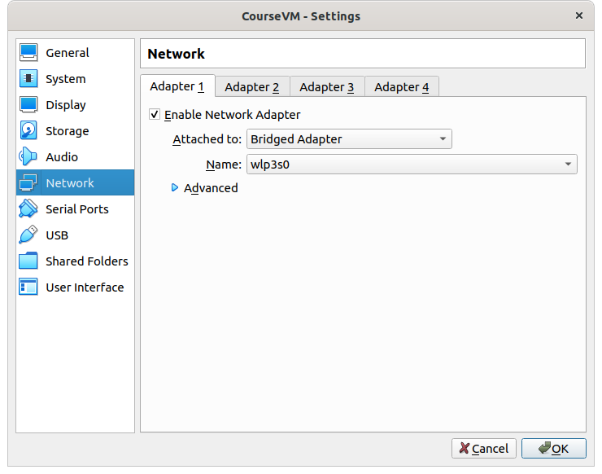
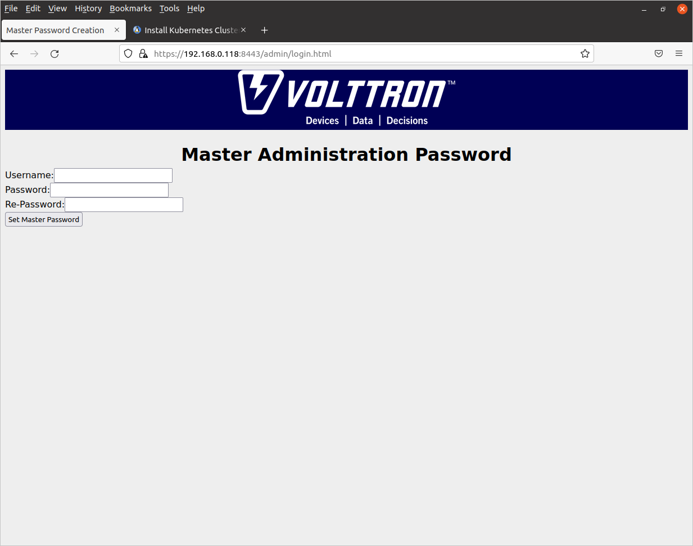
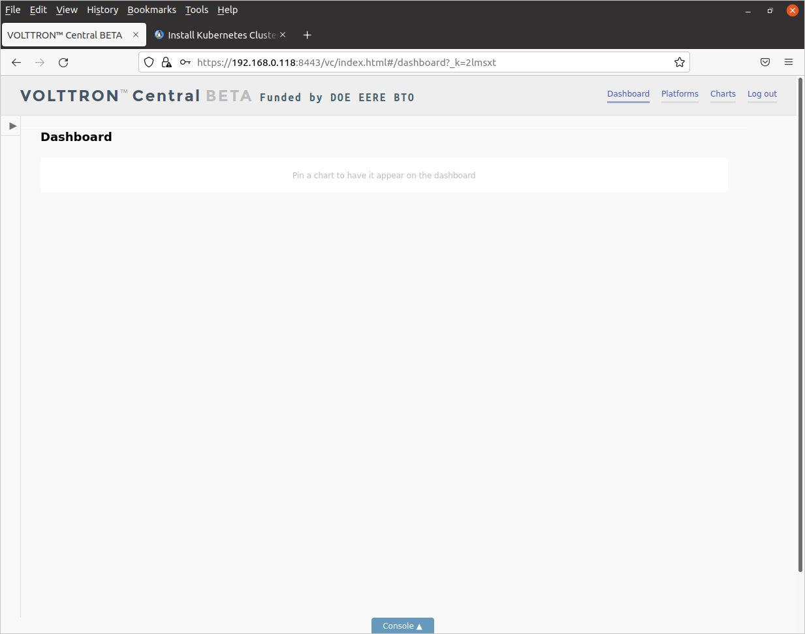

# Deploying the Volttron K8s Gateway Node

The gateway node sits at a remote site, like in a building or at a solar farm,
connected to the site's local area network with routing to the Internet.
A gateway pod with a Volttron deployment acts as an intermediary between the
IoT devices running on site and the Volttron Central pod running on the
control node in the
cloud (nominally Azure but you can change it) or in an on-prem data center. 
The gateway pod monitors IoT devices 
on the site, reports the data back to the Volttron Central node running in the
cloud, and conveys commands from Volttron Central to the devices.

You have a choice of two different preconfigured containerized Volttron microservices
for two IoT device simulators to try out:

- vremote - a Volttron microservice using the fake driver that comes with the 
Volttron distro. This microservice requires no additional simulated or
actual device and no additional network configuration.

- vbac - a Volttron microservice that handles devices using the 
[BACnet protocol](http://www.bacnet.org/). This device requires at most one device
that responds to BACnet. A [simulated AHU device](https://github.com/bbartling/building-automation-web-weather) incorporated by copy as sim_AHU.py here, based on the [BAC0](https://bac0.readthedocs.io/en/latest/) package by Christian Tremblay, is provided courtesy of Ben Barting, see below for more on how to deploy it. The vbac microservice requires additional network configuration which
is discussed in the next section.

## BACnet gateway node network architecture

If you decide to deploy vbac, you will need some additional networking support to
allow the Volttron BACnet proxy agent access to BACnet devices on the local area
network. By default, kube-volttron uses the [Flannel CNI driver](https://github.com/flannel-io/flannel#flannel)
for intra cluster networking between pods. Flannel constructs an isolated overlay network inside the cluster
with CIDR 10.244.0.0/16 using the [VXLAN overlay protocol](https://datatracker.ietf.org/doc/html/rfc7348), and there
is no routing between pods inside the cluster and devices outside by default, though pods on the gateway node 
can communicate with pods on other nodes in the cluster, including the Volttron Central pod in the cloud, through 
the overlay.The figure below illustrates how the BACnet K8s cluster network architecture allows the gateway pod
to communicate with devices on the host IP subnet.

The gateway pod is configured with an additional network interface using some advanced features of the CNI. The [Multus
multi-interface CNI driver](https://github.com/k8snetworkplumbingwg/multus-cni/blob/master/docs/configuration.md) 
connects up both the intra-cluster Flannel network and a second interface imported from
the second interface on the gateway host into the gateway pod. The Multus
git distro is already incorporated by reference into the gateway-node in the
subdirectory multus-cni.
This means the host VM or OS must have two Ethernet interfaces, one
connected to the local area network and the Internet through a router and one that is absorbed into the gateway
pod when it is created. [^1] A K8s yaml manifest is provided to create `NetworkAttachementDefinition` K8s CNI 
object called `bacnet` 
of type `host-device` for the second interface. This obtains its DHCP address from the host IP subnet, 
allowing the Volttron BACnet Proxy Agent running in the gateway pod to conduct UDP traffic over BACnet port 47808 
with devices (both simulated
and real) running on the host IP subnet. The Volttron BACnet Proxy Agent communicates with the Volttron Platform
Driver Agent via the VIP bus running on the Unix socket 22916. Similarly, the other Volttron agents communicate
amongst themselves using the VIP bus. The Actuator Agent, Forwarding Historian, and Volttron Central Platform Agent
communicate with the Volttron Central pod using HTTPs over the intra cluster network on port 8443. T
Note that at this time the Volttron BACnet Proxy Agent does not
conduct BACnet broadcast (WhoIs/IAm) but this architecture should enable broadcast from and to the gateway
pod in the future. Without the second interface, the gateway pod cannot communicate with BACnet devices
on the host IP subnet. [^2]

[^1] The installation directions below walk you through creating a VM with VirtualBox that has an additional 
interface.

[^2] Some CNI drivers that do not use overlays ("flat" drivers) may allow broadcast and direct access to the 
host network, this is an area for future work.

## Preparing the base VM or operating system

As mentioned above, you will need a base VM or operating system with two network interfaces to support
a two interface gateway pod. How you configure an additional 
interface depends on what 
operating system and/or VM manager you are using. Kube-volttron was developed on 
Ubuntu 20.04 using the VirtualBox VMM, so the directions for adding an 
additional interface are explained in detail in the following subsections.

### Clone a VM or import an ISO for a new one.
Clone an existing VM using VirtualBox by right clicking on the VM in the left side menu bar and choosing *Clone* from the VM menu.

### Bring up the Network Settings tab
Right click on the new VM in the left side menu bar of the VirtualBox app
to bring up the VM menu, then click on *Settings*. When
the *Settings* tab is up, click on *Network* in the left side menu bar. You should get a tab that looks like this:

Be sure your first interface is a *Bridged Adaptor* and not NAT or anything else

### Configure the second interface

Click on the *Adaptor 2* tab then
click the check box marked *Enable Network Adaptor*. Select the 
*Bridged Adaptor* for the network type.

### Save the configuration

Save the configuration by clicking on the *OK* button on the bottom right.

Your VM should be ready to run.

## If you have a cloud Volttron Central already deployed

If you already have a K8s node deployed in the cloud, you should use the [BYOH 
ClusterAPI](https://github.com/vmware-tanzu/cluster-api-provider-bringyourownhost) operator to deploy and provision your gateway node, see the parent README and you can skip the next section since ClusterAPI handles K8s installation on
worker nodes.

## Deploying K8s on the node.

`kubeadm` is the recommended deployment tool for K8s on the ndoe, because many other K8s distros are opinionated
about networking in specific ways that may be incompatible 
with running a pod having a second interface onto the host subnet. You can find instructions for
installing K8s with `kubeadm` [here](https://computingforgeeks.com/deploy-kubernetes-cluster-on-ubuntu-with-kubeadm/). 
The page includes instructions for installing
the Docker runtime but be sure to also install the Mirantis docker shim,
since the shim is no longer distributed with K8s by default.

For cluster networking, you can use whatever CNI provider you like, but I used
Flannel, which is the simplest (constructs an overlay network in the 10.244.0.0/16
private address space). Instructions for installing Flannel are [here](https://github.com/flannel-io/flannel#flannel).

After `kubeadm` is done, it will print out a command for adding a node to the
cluster. While it isn't likely you will need this for the gateway node, best to 
save it into a file in case you do.

You also need to remove the taint on the K8s control node that prohibits app 
workloads from running on it, since the gateway cluster only has one node. 
Use the following command:

	kubectl taint nodes <control-node-hostname> node-role.kubernetes.io/master-
	
## Installing the Multus multi-network CNI driver

In order to deploy a multi-interface pod, you need to install the Multus CNI driver.
Instructions for installing Multus are [here](https://github.com/k8snetworkplumbingwg/multus-cni/blob/master/docs/quickstart.md). There are other options for 
handling multi-interface pods, but they are all complicated and primarily for
software defined networking telcom use cases. We only need one pod with two 
interfaces, one for the intra cluster pod network and one for talking to BACnet devices on the host subnet.

Note that there is no way to uninstall Multus once you have installed it, so don't install it on a K8s cluster
where you don't want to run multiple CNI drivers.

## Configuring the host network to support a multi-interface pod

Multus requires IP address management (ipam). We use DHCP to provision the
address from the DHCP server running on the host subnet.

First, edit `/etc/sysctl.conf` and uncomment `net.ipv4.ip_forward=1` and 
`net.ipv6.conf.all.forwarding=1` to enable routing on the host after reboot and
use the command:

	sudo sysctl <routing variable>=1

where `<routing variable>` is  `net.ipv4.ip_forward` and `net.ipv6.conf.all.forwarding` to enable routing in the running host.

You can test whether your configuration has worked by running:

	sudo sysctl -a | grep <routing variable>

Unfortunately, Multus cannot find 
the DHCP server on your host subnet without a relay, so we need
to start the CNI DHCP relay on the host. Two utility scripts are provided 
for this purpose. The scripts run commands with `sudo` so you will be prompted 
for your password:

- `start-dhcpd.sh` - Start the CNI DHCP relay daemon. Handles cleanup of 
old log file 
or creation of a directory for the log file and CNI dhcp daemon socket file if the directory
doesn't exist.

- `stop-dhcpd.sh` - Kills the CNI DHCP relay daemon

[This page](https://www.cni.dev/plugins/current/ipam/dhcp/)
provides more information on enabling DHCP ipam for K8s.

## Kubernetes manifests for deploying gateway pods

A collection of Kubernetes yaml manifests are provided for testing and demos.
In addition to manifests for the two gateway pods, a manifest is provided 
for deploying a Volttron Central pod including the SQL Lite historian, in case
you want to try out the gateway node standalone. This section describes the
manifests. 

Note that if you decide to develop your own Volttron microservice containers, 
you will need to replace the name of the container image in the manifests under the 
`spec.template.containers.image` key, which is currently set to
`jkempf41/public-repo:<image type tag>`, with your own repository and image tag.

### Volttron Central microservice manifests

The Volttron Central microservice requires the following two manifests: 

- `vcentral-deploy.yml`: This sets up a K8s `Deployment` for a vcentral Volttron Central microservice with an 
SQL Lite historian having the database embedded inside the container. 
The deployment has only one replica since the database is not replicated. The
K8s `Deployment` restarts the pod if it crashes.

- `vcentral-service.yml`: This defines a `ClusterIP` type service for vcentral, but
with an external IP address so that you can access the Volttron Central 
Web UI from a 
browser running on the host for testing. You should replace the IP address in
the manifest, the array value bound to the key `spec.externalIPs`, with the IP address of your host machine. 
Currently this is set to `192.168.0.118`. The Volttron Central Web UI will run on the standard Volttron port,
8443, on your host machine so be sure there is no other service running on
that port. The service manifest also contains a port definition for the 
VIP bus port at port number 22916 so the gateway pods can connect to
the VIP bus (individual pods in a K8s cluster have no access to a common Unix
socket which is how agents typically communicate on the VIP bus). 
Note that the `externalIPs` configuration is
only for development, testing, and demo purposes. In the actual Volttron
Central deployment in the cloud, this should be replaced with a K8s `Ingress` or
`Gateway` object.

### Vremote microservice with the fake driver manifests

The vremote microservice requires the following two manifests:

- `vremote-deploy.yml`: Creates a one pod `Deployment` of the vremote microservice, with a forwarding historian to send data to the Volttron Central pod historian. 

- `vremote-service.yml`: A `ClusterIP` type service for the vremote pod, with HTTP and VIP ports defined. 
There is no external IP definition for the vremote microservice,
since the vremote microservice is only accessed through the Volttron Central Web UI.

### BACnet NetworkAttachmentDescription manifest for second gateway pod interface

The K8s CNI handles additional pod interfaces though a 
`NetworkAttachmentDescription` object. 
Multus requires a network attachment point definition to configure the vbac 
pod with the second interface. 
The file `bacnet-net-attach-desc.yml` contains an attachment definition for the
gateway pod's second interface. Multus matches the `NetworkAttachmentDefinition` 
`metadata.name` value (`bacnet` in this case) with a configuration item in 
the `Deployment` pod spec for the second interface. The `spec.config` value is a 
JSON object providing the configuration for the second interface.

Edit the manifest to configure it to your network as follows:

- Find the name of the second interface on your host by typing `ifconfig` or `ip address` 
to a `bash` shell.

- Edit the `bacnet-net-attach-desc.yml` file and change the `"device"` 
property value, which is set to `"enp0s8"`, to the name of the second network 
interface on your host machine. This interface will get 
absorbed into the cluster network namespace and disappear from the
host network namespace when you deploy a pod with a
second interface.

### Configmap manifests for vbac

The K8s `Configmap` object provides a way to inject configuration data into a container when a pod is deployed. 
Container images can be distributed without the final configuration in them, and 
then a customized configuration specific to the particular deployment environment can be injected when
the container is deployed.
This is actually contrary to the way the original volttron-docker distro does configuration. A
Volttron deployment is built and configured on the machine where it is to run from scratch. However, the
microservice-volttron distro has been engineered to allow redistributable containers. 

The two yaml files defining `Configmap` objects are:

- `bacnet-configmap.yml`: Creates a `Configmap` in the `/home/volttron/configs/bacnet` directory with
two file "keys": `sim-AHU.config` and `sim-AHU.csv`. The first contains the IP address of the simulated
AHU device and other data for the BACnet driver, the second contains the simulated AHU device schema we
are interested in accessing. These files are only loaded by Volttron when it builds the vbac image, after
that they are not accessed.

- `platform-driver-configmap.yml`: Contains exactly the same information as `bacnet-configmap.yml`, 
except it is placed into a directory where the Volttron build process squirrels away configuation 
data, `/home/volttron/.volttron/configuration_store`. The information is in a different format, basically
a consolidation of the `sim-AHU.config` and `sim-AHU.csv` files into a single JSON object. This is the
file that is loaded into the Platform Driver Agent BACnet driver when the vbac container boots.

### Vbac microservice manifests for BACnet devices

The vbac microservice with the gateway for the BACnet protocol consists of two 
manifests:

- `vbac-deploy.yml`: Creates a one pod `Deployment` of the vbac microservice
running the Volttron BACnet Proxy Agent, with a forwarding historian to send data to 
the Volttron Central pod historian database. This manifest needs to be customized to
your network as described below.

- `vbac-service.yml`: A `ClusterIP` type service for the vbac pod, with 
HTTP and VIP ports defined. There is no external IP definition for the 
vbac service, since the vbac service is accessed only through the Volttron 
Central Web UI.

Customize the `vbac-deploy.yml` Deployment manifest as follows:

- Edit the file and replace the value of the `"default-route"` property, set to  `"192.168.0.118"`, in the JSON object that is the value of the 
`spec.template.annotaions.k8s.v1.cni.cncf.io/networks` key with the IP 
address of your host machine. Normally with Flannel, the default route goes out the `eth0` interface as shown in
the above diagram and over `cni0` host interface into the `flannel` overlay. 
Changing the default route ensures that traffic to the host subnet exits the pod
through the `net0` interface which is on the host subnet.

## Deploying the vcentral microservice pod

You need to have a Volttron Central microservice deployed somewhere in your cluster
network before deploying any gateways, because the gateways used hostname base service discovery look for the
Volttron Central hostname (`vcentral` in the default image) to connect up
with Volttron Central. If you don't have a cloud or on-prem remote Volttron Central deployed
you can deploy a test vcentral microservice in
the standalone gateway cluster as follows. 

First, deploy the `Service` with:

	kubectl apply -f vcentral-service.yml
	
Then the `Deployment`:

	kubctl apply -f vcentral-deploy.yml
	
Check if the pod is running with:

	kubectl get pods
	
If the pod is running, you should see something like:

	NAME                       READY   STATUS    RESTARTS      AGE
	vcentral-97b777d64-thd95   1/1     Running   0             2m
	
The first time you start it, it may take a while to download the image.

You can test whether the Volttron Central microservice is running by 
using your browser to browse to the Web page. Browse to the URL
`https://<host IP address>:8443/index.html`. This will bring up the
Volttron Central admin splash page:

Click on *Login to Administration Area* to bring up the master admin
config page, where you can set the admin username and password:

After filling in the admin username and password, click *Set Master Password* and you should see the admin login page come up.

You can view the Volttron Central dashboard web app by browsing to the URL 
`https://<host machine IP address>:8443/vc/index.html`. This will bring up the Volttron Central login page:

Type in the username and password you previously entered to the admin config. You 
should now be in the Volttron Central dashboard Web app:

This should verify that the vcentral microservice is working.

Note that the vcentral microservice uses SQL-lite so the database will not
outlive the pod lifetime unless you modify the `Deployment` pod spec
to mount a persistent volume at `/home/volttron/db` for the database.

### Deploying the vremote microservice pod

If you just want to try out kube-volttron, you can deploy the vremote pod with
the fake driver. First you need to deploy the vremote `Service`:

	kubectl apply -f vremote-service.yml
	
Then the `Deployment`:

	kubctl apply -f vremote-deploy.yml
	
Check if the pod is running with:

	kubectl get pods
	
If the pod is running, you should see something like:

	NAME                       READY   STATUS    RESTARTS      AGE
	vcentral-97b777d64-tvnml   1/1     Running   0             30m
	vremote-847b9686c4-wn8tz   1/1     Running   0             14s

You can check if the vremote gateway is visible in Volttron Central by returning
to your browser, clicking the refresh button, then clicking on *Platforms*. 
You should see a display like this:

Notice that the display says that 0 agents are running. This is because Volttron
uses the process id of the agent process to determine if the agent is running, but
if the agent is running in a separate container, the process id will be in a 
separate Linux namespace and therefore invisible to the Volttron Central web app.

Clicking on *vremote* shows the agents running in the vremote microservice:

Go up to the menu bar in the upper right hand corner and click on *Charts*.
This will bring up a display where you can configure charts of data to display.
Click on *Add Charts* button and the *Add Chart* dialog should come up. Click on the *Topics* pulldown list.
You should see a pulldown list of variables you can display (*OutsideAirTemperature1*, etc.).
If you'd like to display a chart, select the variable, then select the chart type in the *Chart Type* pulldown.

This should confirm that your vremote gateway microservice pod is running and can connect to the vcentral pod
running on the local node.

Be sure to remove the vremote `Deployment` before creating the vbac `Deployment`:

	kubectl delete deploy vremote
	
## Deploying the simulated BACnet AHU

The Python file `sim-AHU.py` is a copy of Ben Barting's simulated air handling unit, programmed on top of the
BAS0 package. Install the BAS0 package using `pip`:

	pip install BAS0
	
In a separate bash shell window, start the simulated air handling unit:

	python3 sim-AHU.py
	
You should see the following:

	2022-05-07 19:26:00,094 - INFO    | Starting BAC0 version 21.12.03 (Lite)
	2022-05-07 19:26:00,095 - INFO    | Use BAC0.log\_level to adjust verbosity of the app.
	2022-05-07 19:26:00,095 - INFO    | Ex. BAC0.log\_level('silence') or BAC0.log_level('error')
	2022-05-07 19:26:00,095 - INFO    | Starting TaskManager
	2022-05-07 19:26:00,125 - INFO    | Using ip : 192.168.0.118
	2022-05-07 19:26:00,177 - INFO    | Starting app...
	2022-05-07 19:26:00,177 - INFO    | BAC0 started
	2022-05-07 19:26:00,178 - INFO    | Registered as Simple BACnet/IP App
	2022-05-07 19:26:00,180 - INFO    | Update Local COV Task started
	2022-05-07 19:26:00,181 - INFO    | Adding DPR0-O to application.
	2022-05-07 19:26:00,181 - INFO    | Adding DPR1-O to application.
	2022-05-07 19:26:00,181 - INFO    | Adding DPR2-O to application.
	2022-05-07 19:26:00,181 - INFO    | Adding DPR3-O to application.
	2022-05-07 19:26:00,181 - INFO    | Adding DPR4-O to application.
	2022-05-07 19:26:00,181 - INFO    | Adding DPR5-O to application.
	2022-05-07 19:26:00,181 - INFO    | Adding DPR6-O to application.
	2022-05-07 19:26:00,181 - INFO    | Adding DPR7-O to application.
	2022-05-07 19:26:00,181 - INFO    | Adding DPR8-O to application.
	2022-05-07 19:26:00,181 - INFO    | Adding DPR9-O to application.
	2022-05-07 19:26:00,181 - INFO    | Adding DAP-SP to application.
	2022-05-07 19:26:00,182 - INFO    | Adding SF-S to application.
	2022-05-07 19:26:00,182 - INFO    | APP Created Success!
	2022-05-07 19:26:00,182 - INFO    | DPR0-O is Real(50)
	2022-05-07 19:26:00,182 - INFO    | Duct Pressure Setpoint is Real(1)
	2022-05-07 19:26:10,188 - INFO    | DPR1-O is Real(50)
	2022-05-07 19:26:10,189 - INFO    | Duct Pressure Setpoint is Real(1)
	2022-05-07 19:26:20,195 - INFO    | DPR2-O is Real(50)
	2022-05-07 19:26:20,196 - INFO    | Duct Pressure Setpoint is Real(1)

Note down the IP address in line 5, since you will be using that to edit the Volttron Platform Driver Agent configuration.

Since the vbac container has the basic configuration for the simulated AHU baked
in, you will have to build another container with configuration if you
want to deploy BACnet with other devices. See the Volttron documentation pages
[here](https://volttron.readthedocs.io/en/main/driver-framework/bacnet/bacnet-auto-configuration.html) about the scripts you'll need to run to find BACnet
devices and generate configuration files for the Platform Driver Agent BACnet 
driver.

## Deploying the vbac pod

### Customize the Platform Driver Agent `ConfigMaps`

Edit the two `Configmap` files `bacnet-configmap.yml` and `platform-driver-configmap.yml` and
replace the IP address `192.168.0.118` with the IP address on which `sim-AHU.py` is running, noted 
down in the previous step.

Create the two `Configmaps` using `kubectl`:

	kubectl apply -f bacnet-configmap.yml
	kubectl apply -f platform-driver-configmap.yml

You can check if the creation operation succeeded with:

	kubectl get configmap bacnet-config
	kubectl get configmap platform-driver-config

or print more detailed information using `kubectl describe`.

### Creating the vbac `Service`

Before creating the vbac `Deployment`, you first need to create the vbac `Service` and the `bacnet` `NetworkAttachmentDescription`.

Create the vbac `Service` as follows:

	kubectl apply -f vbac-service.yml
	
This creates a `ClusterIP` service for vbac on both the http (port 8443) and the VIP bus (port 22916). 
The VIP bus port
is primarily a Unix socket and so not visible outside the pod, but is reserved anyway.

Create the `bacnet` `NetworkAttachmentDescription` as follows:

	kubectl apply -f bacnet-net-attach-desc.yml
	
Note that if you want to look at the `bacnet NetworkAttachementDescription`, you need to give
`kubectl` the full name for the object type:

	kubectl describe networkattachmentdescription.k8s.cni.cncf.io bacnet
	
### Creating the vbac `Deployment`

Create the vbac deployment as follows:

	kubectl apply -f vbac-deploy.yml
	
	
Use:

	kubectl get --watch pod
	
to watch the pods until the vbac pod is running. Note that the pod will have a uuid after the generic
pod name "vbac".

### Check whether the deployment was successful from the Volttron Central web app

Using the Vottron Central web app deployed either locally or in the cloud, check whether the deployment was
successful by logging in and navigating to the *Platforms* page as described above. Click on *vbac*->*Charts*->*Add Chart*.
In the *Add Chart* dialog, click on the *Topics* pulldown and you should see a pulldown list as in the following display:

Click on one of the topics then move down to the *Chart Type* pulldown list to add a chart.

## Troubleshooting

If you run into trouble deploying one of the microservice `Deployments`, you can use the `kubectl` log command to check the container logs:

	kubectl get pods
	kubectl logs <pod name>

If you are having problems with networking or service discovery, you can
troubleshoot by exec-ing into one of the pods and using the Ubuntu 
Linux networking tools. 

